# Lab 100: Getting Started with Intelligent Bot
## Introduction
This lab walks you through the steps to explore AMCe Intelligent Bot UI, import a chatbot called University Workshop Bot, and lastly interact with the chatbot. This chatbot is for our fictional generic university. It will be used for customers to ask worker questions (via automated FAQ) and update basic infomration, through this user-friendly and interactive chatbot, finally they can get proper answers and update.

## Objectives
- Understand AMCe Intelligent Bot UI
- Import the skeleton of university workshop bot from workshop artifacts
- Interact with the bot

## Required Artifacts
- The following lab requires an Oracle Public Cloud account. You may use your own cloud account, a cloud account that you obtained through a trial, or a training account whose details were given to you by an Oracle instructor.

---
### Step 0: Clone Artifacts
- Clone artifacts required for this lab to a local directory. We will be using them throughout all labs.   
  `git clone https://github.com/restonappdev/Oracle-University-Workshop-Artifacts`

### Step 1: Sign In to Oracle Cloud
-   a). Go to <a target="_blank" href="https://myservices.us.oraclecloud.com/mycloud/signup?language=en&sourceType=:se:eo:ie:2t:RC_NAMK180429P00004:OCSH_Reston&evite=:se:eo:ie:2t:RC_NAMK180429P00004:OCSH_Reston">free trial registration page</a>, sign up a free trial account;
    (Note: When you are doing the sign up, for adding credit card section, please make sure address is same to your billing address.)

-   b). Then go to <a target="_blank" href="https://cloud.oracle.com/getting-started">cloud.oracle.com</a>, click **Sign In** to sign in with your free Oracle Cloud account.

-   Enter your **Cloud Account Name** and click **My Services**.

-   Enter your Cloud **username** and **password**, and click **Sign In**.

### Step 2: Access Autonomous Mobile Cloud Enterprise

- Now, you are in the Oracle Cloud dashboard. Click on the hamburger menu button on the upper left of the screen and expand **Services**.
- Note: a. At first time, if you cannot find this cloud service, click 'Compute Classic', then you will find it.
        b. Make sure your 'Identity Domain' which is on the right-top side is correct.

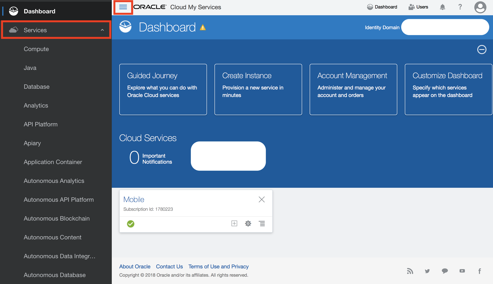

- Scroll down and find **Autonomous Mobile Enterprise** and click on it.

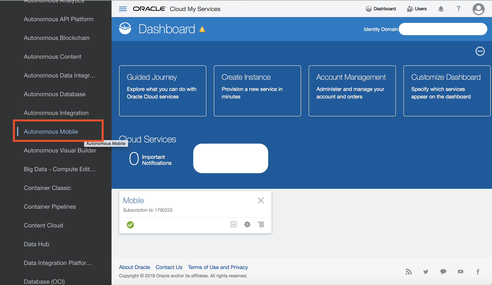

- Now, you should see your AMCe's instances. Click on the hamburger button next to the instance and then click on **Go to Instance Home**. 

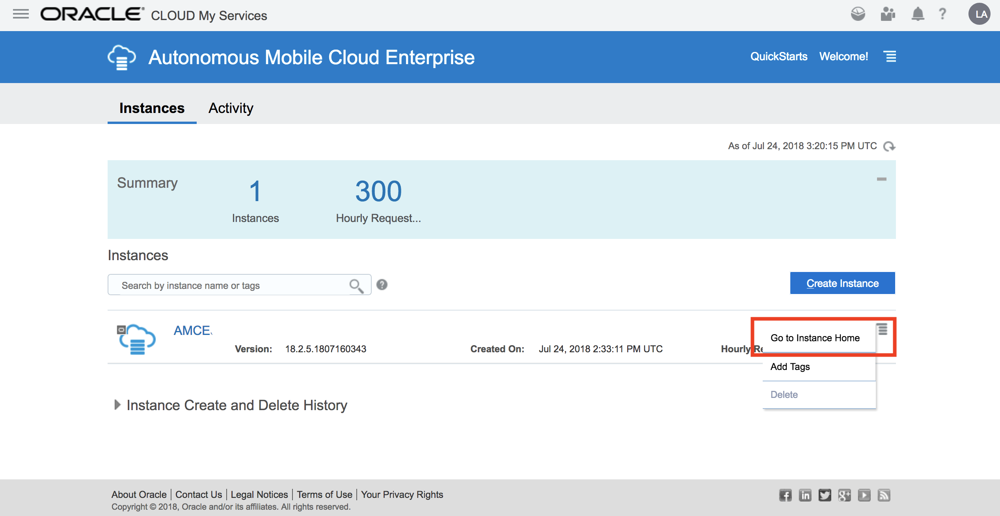

- Now, you should be in AMCe's dashboard page. Click on the hamburger menu icon on the upper left of the screen, and then expand **Development** dropdown

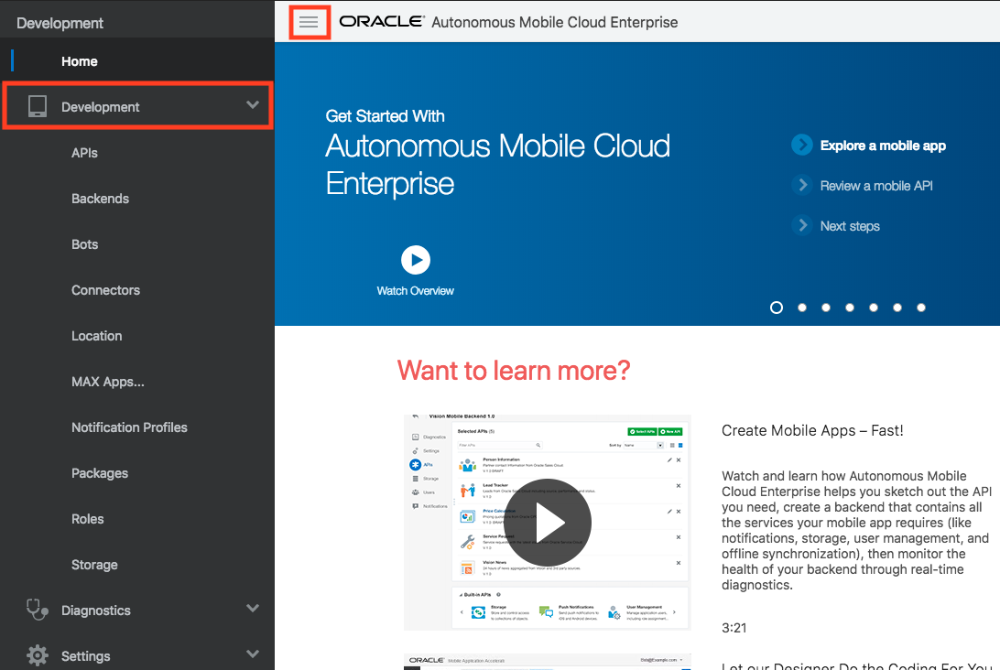

- As you can see, there are a lot of features included with AMCe. Today, we will just focus on Bots. Click on **Bots** to navigate to the Intelligent Bot UI.

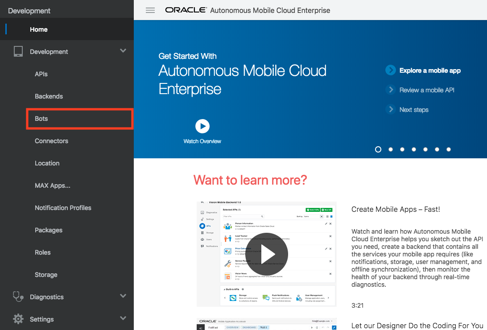

- If you see a tour page, go ahead and click on **Got It!** since we are going to take you through a personal tour.

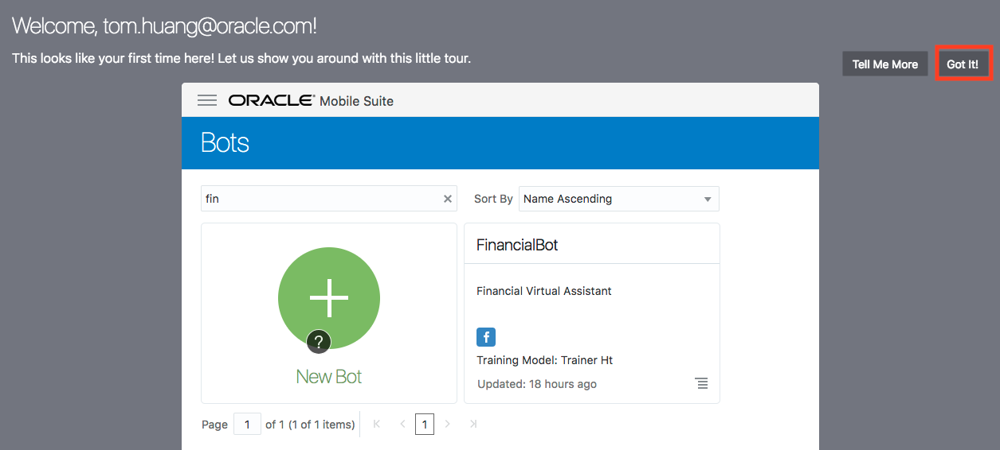

### Step 3: Import University Workshop Bot

- Now, you are in the bot dashboard. Close the side bar menu by clicking on the hamburger menu icon on the upper left of the screen again. 

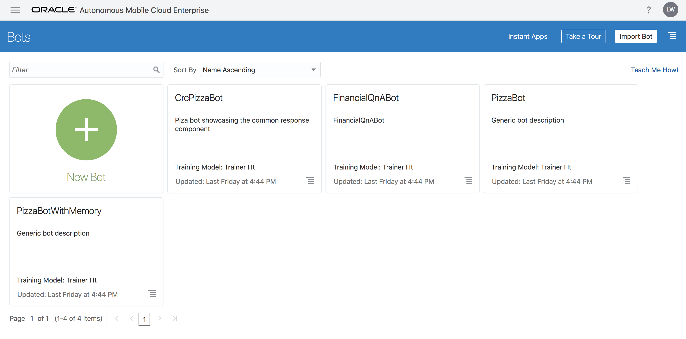

- Here we have the dashboard for all of your chatbots. We are going to import a basic gen univeristy chatbot. We will improve this chatbot's workflow in later labs. Click on **Import Bot** on the top right of the screen and select the **UniversityWorkshopBot.zip** from the files you cloned from git. 

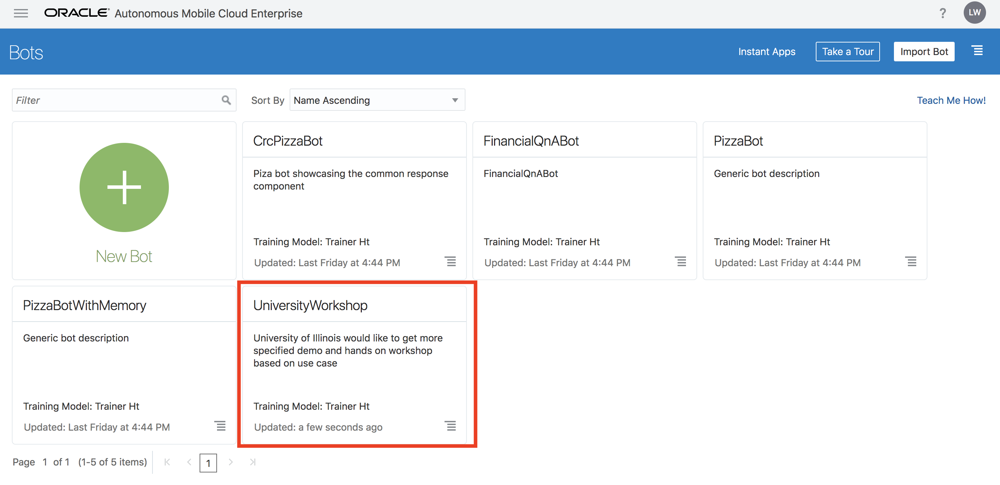

- This will import a bot called "UniversityWorkshop". Go ahead and click on it to see the details.

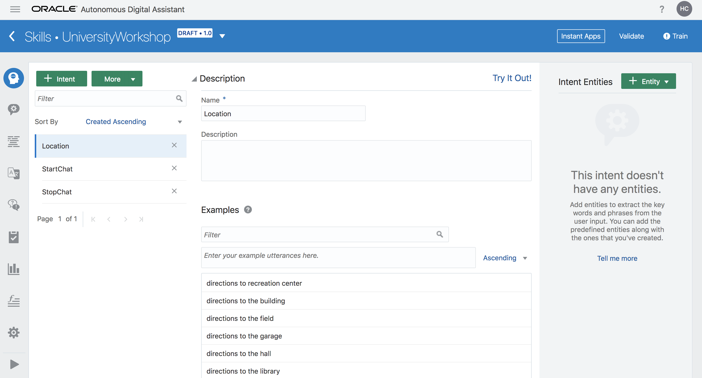

- On this page is where you will develop the rest workflow with the integration of backend & API services (e.g. HCM backend service), configuration of Q&A, and channels for the bot. We will dive into each section on the next lab. 

- In order to test the functionality and the flow of the current bot: 
   a. you should train the bot firstly. 
   b. clicking on the Play button on the top right of the screen which will open up a testing place to test the functionality of your chatbot before you fully commit to it. 
   c. Go ahead and chat with the bot. You can say "hello". 

:: Trainning Before:
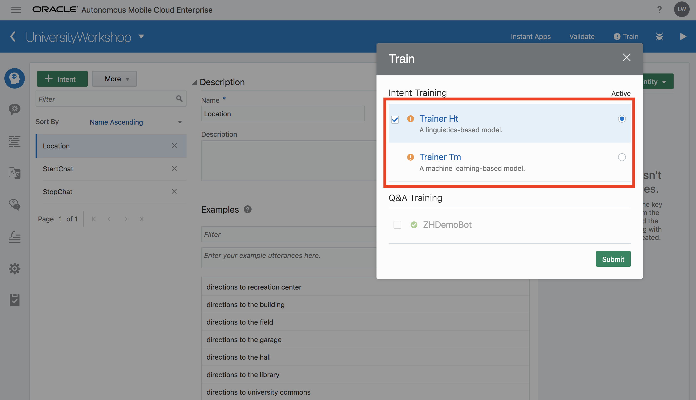

:: Trainning After:

:: Testing Bot:
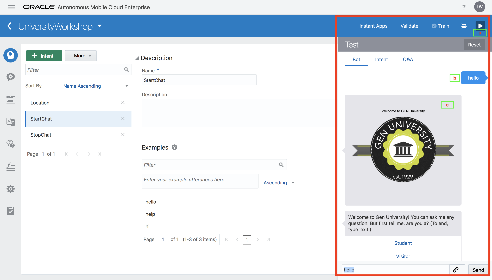

- As you can see, it will reply with welcome message and service you might like to chose. Select one service you would like to use. Student service will allow you to get or update students basic information (such as: phone, email, address etc.); Visitor service will provide you FAQ answers on the basic of your asked questions.

- Now, you have familiarized with the dashboard, imported a chatbot, and interacted with a chatbot. The bot is interactive but we would like to add more functionalities to it. Let's do that in the next lab!

**[Navigate to Lab 200](Lab200.md)**