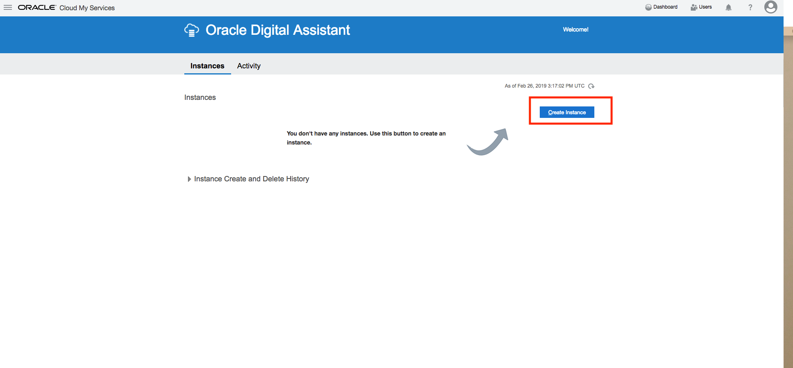
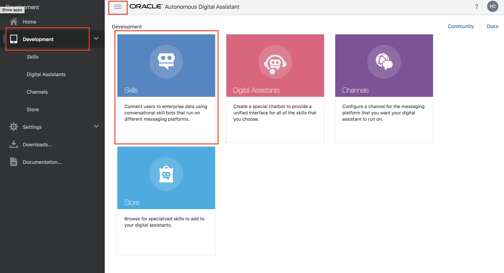
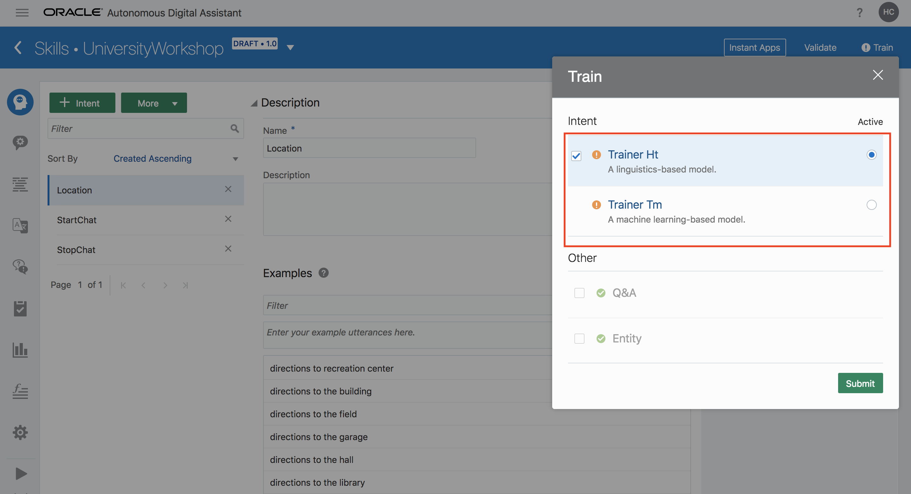
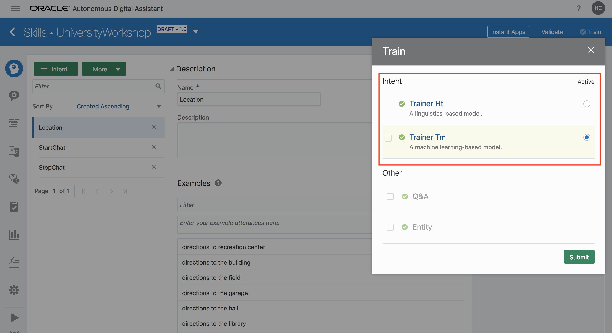

# Lab 100: Getting Started with DA One Skill
## Introduction
This lab walks you through the steps to explore ODA Skill UI, import a skill called University Workshop Bot, and lastly interact with the skill. This skill is for our fictional generic university. It will be used for customers to ask worker questions (via automated FAQ) and update basic information, through this user-friendly and interactive skill, finally they can get proper answers and update.

## Objectives
- Understand ODA Skill UI
- Import the skeleton of university workshop bot from workshop artifacts
- Interact with the skill

## Required Artifacts
- The following lab requires an Oracle Public Cloud account. You may use your own cloud account, a cloud account that you obtained through a trial, or a training account whose details were given to you by an Oracle instructor.

---
### Step 0: Clone Artifacts
- Clone artifacts required for this lab to a local directory. We will be using them throughout all labs.   
  `git clone https://github.com/restonappdev/Oracle-University-Workshop-Artifacts`

### Step 1: Sign In to Oracle Cloud
-   a). Go to <a target="_blank" href="https://myservices.us.oraclecloud.com/mycloud/signup?language=en&sourceType=:se:eo:ie:2t:RC_NAMK180429P00004:OCSH_Reston&evite=:se:eo:ie:2t:RC_NAMK180429P00004:OCSH_Reston">free trial registration page</a>, sign up a free trial account;
    (Note: When you are doing the sign up, for adding credit card section, please make sure address is same to your billing address.)

-   b). Then go to <a target="_blank" href="https://cloud.oracle.com/getting-started">cloud.oracle.com</a>, click **Sign In** to sign in with your free Oracle Cloud account.

-   Enter your **Cloud Account Name** and click **My Services**.

-   Enter your Cloud **username** and **password**, and click **Sign In**.

### Step 2: Access Oracle Digital Assistant

- Now, you are in the Oracle Cloud dashboard. Click on the hamburger menu button on the upper left of the screen and expand **Services**.
- Note: 
	- Scroll a little bit and find **Digital Assistant** and Provision one instance.

- Provisioning an ODA instance
  ** Currently, With FREE TRIAL account, you cannot provision ODA instance until the transition is completed.**

:: Click **Create Instance** 

:: Fill fields' data, then Click **Next** 

:: Click **Confirm**, after you review the information
 
  ** For the workshop, you may contact with sales representative. **

- Now, you should be in ODA's dashboard page. Click on the hamburger menu icon on the upper left of the screen, and then expand **Development** dropdown

- As you can see, there are a lot of features included with ODA. Today, we will just focus on Skills and Channels. Click on **Skills** to navigate to the Skill UI.

### Step 3: Import University Workshop Bot

- Now, you are in the DA dashboard. Close the side bar menu by clicking on the hamburger menu icon on the upper left of the screen again. 

- Here we have the dashboard for all of your skills. We are going to import a basic gen univeristy chatbot. We will improve this skill's workflow in later labs. Click on **Import Skill** on the top right of the screen and select the **UniversityWorkshopBot.zip** from the files you cloned from git. 

- This will import a skill called "UniversityWorkshop". Go ahead and click on it to see the details.

- On this page is where you will develop the rest workflow with the integration Custom Component API services (e.g. HCM backend service), configuration of Q&A, and channels for the skill. We will dive into each section on the next lab. 

- In order to test the functionality and the flow of the current skill: 
   - You should train the skill firstly. 
   - Clicking on the Play button on the bottom right of the screen which will open up a testing place to test the functionality of your skill before you fully commit to it. 
   - Go ahead and chat with the skill. You can say "hello". 
   - You can exit test bot by clicking 'Close' and reset the converstation by clicking 'Reset' buttons. 

**:: Before Training:**

**:: After Training:**

**:: Test Play Button:**

**:: Testing Bot:**

- As you can see, it will reply with welcome message and service you might like to chose. Select one service you would like to use. Student service will allow you to get or update students basic information (such as: phone, email, address etc.); Visitor service will provide you FAQ answers on the basic of your asked questions.

- Now, you have familiarized with the dashboard, imported a skill, and interacted with a skill. The bot is interactive but we would like to add more functionalities to it. Let's do that in the next lab!

**[Navigate to Lab 200](Lab200.md)**