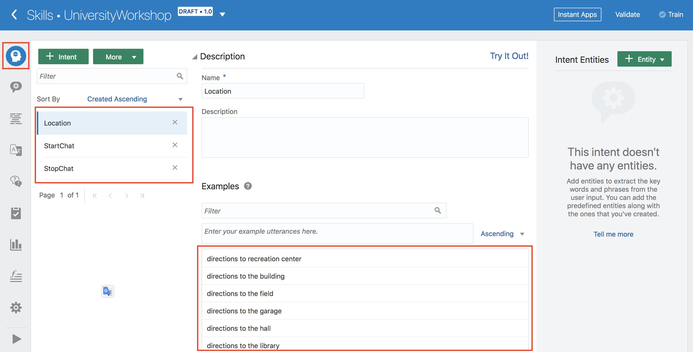
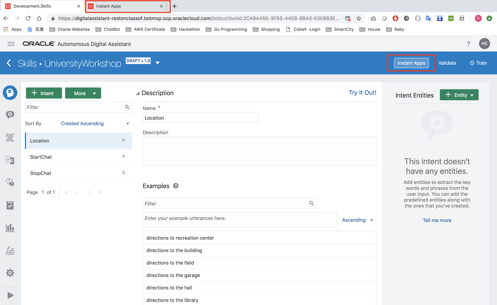
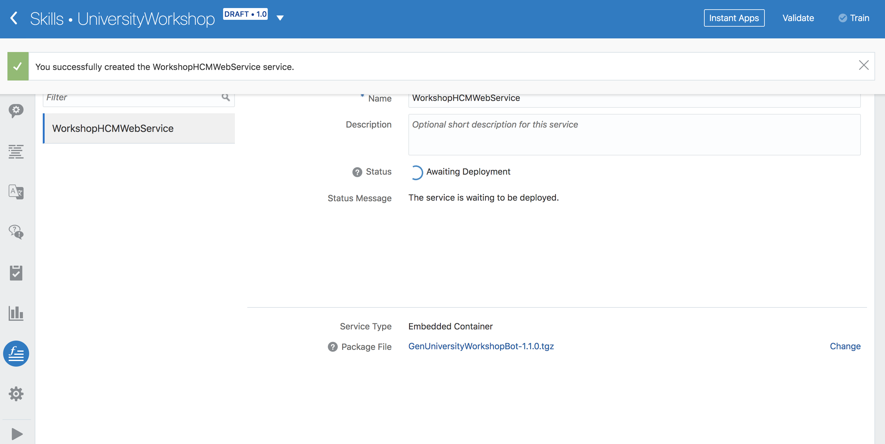

# Lab 200: Enhance Gen University Bot
## Introduction
This lab will dive into the details of development of the skill. We will learn about Intent & Entity feature of Bots, create instant app for login, set up APIs for skill and lastly add dialog flows, this will make Gen University Bot more interactive.

## Objectives
- Learn about Intent & Entities feature of ODA Skill
- Add an instant app of login to the skill interaction
- Set Up Custom REST APIs for skill
- Add interactive dialog flow code.

## Required Artifacts
- The following lab requires an Oracle Public Cloud account. You may use your own cloud account, a cloud account that you obtained through a trial, or a training account whose details were given to you by an Oracle instructor.
- You should have completed Lab 100 of this workshop.

---
### Step 1: Learn about Intent & Entities feature of AMCes
- Navigate to University Workshop Bot that you have imported on lab 100. 


- On the first screen, you can define intents for your skill. Intents illustrate your use case by describing the various actions that your skill helps its users complete.
- There are 3 intents that came with the import file: Location, StartChat, and StopChat. Under each intent tab, there are utterances which are the sample phrases or sentences that you expect the user to say for that specific intent so that your skill will match those phrases to the intent. 
- While intents map words and phrases to a specific action, entities add context to the intent itself. They help to describe the intent more fully and enable your skill to complete a user request. The Location intent, for example, describes a user request, but only in general terms.



### Step 2: Add an instant app of login to the skill interaction
- Note: With this Gen University chatbot, we are using Oracle HCM service, so if you want to test login module functionality, for HCM login username and password, you can send request from our end, then you may get a temporary account.

- Natural language conversations are, by their very nature, free-flowing. But they may not always be the best way for your skill to collect information from its users. For example, some situations, like sign in in some sites, require users to enter specific information (and enter it precisely). To help your skill's users enter this type of information easily, your skill can call an instant app, which provides forms with labels, options, choices, check boxes, data fields, and other UI elements.

- Click on **Instant Apps** next to Validate button on top right of the screen. (This is a pop-up that might be blocked by your browser; unblock it to continue.)



- This will take you to a dashboard for Instant Apps. Here, we will click on **Add Instant App**. 


- As you can see, there are many templates you can choose from to help you build an instant app. For today, we will import a pre-built one. Click on **Import** on the right the screen and drag and drop **HCM-Login-Tests.json** from the folder you have cloned from github. 


- After you have done so, you should see a **HCM Login Tests** created. If it says inactive, go ahead and activate it. 


- Click on **'HCM Login Tests'** app and click on **Layout** tab. You should be able to see a preview of the app on the right side. This is what the app will look like. Let's leave it as is and go back to the flow editor of UniversityWorkshop Bot.


- Click on **Save** on upper right of the screen to close

- To be able to use the instant app we just added, we need to add another state to our flow using `System.Interactive` component. This will be finished in Step 4.

### Step 3: Set Up Custom REST APIs for skill
- Now, Intents, Entities, and Instant app are ready, we need to create skill custom API services which are supported in our ODA. In order to get or update a student's basic information e.g. email, address, phone. We need to develop a backend service which can get or make the update real-time with Oracle HCM.

- Click a function icon and click 'service' button to create service.


- In pop-up windown, input **Name**, upload **GenUniversityWorkshopBot-1.1.0.tgz** cloned from the github and click 'Create'


- Once you upload the tgz file, it will have the upload message and show the 'Awaiting Deploying' messages


- Now, you will be able to see 3 APIs under **WorkshopHCMWebService**


### Step 4: Add interactive dialog flow code
- Now, let us integrate the workflow of Gen University Bot.
- Copy & Paste below block code under '#HERE - Copy & Paste HCM initial variables below'

**When copying, please also include the leading white spaces and/or indentation on the first line to avoid any errors.**
```
    fullname: "string"
    fieldattr: "string"
    login: "string"
    testu: "string"
    testp: "string"
    isconfirm: "string"
    isqna: "string"
    iscommon: "string"
    isget: "string"
    updateAttr: "UpdateFields"
    updatefield: "string"
    updateinfo: "string"
```
- Copy & Paste below block code under '# HERE - Copy HCM set variable YAML code below:'

**When copying, please also include the leading white spaces and/or indentation on the first line to avoid any errors.**
```
  setUsername:
    component: "System.SetVariable"
    properties:
      variable: "testu"
      value: "not set"
    transitions: {}
  setPassword:
    component: "System.SetVariable"
    properties:
      variable: "testp"
      value: "not set"
    transitions: {}
```

- Copy & Paste below block code under '# HERE - Replace new Main intent YAML code below:'

**When copying, please also include the leading white spaces and/or indentation on the first line to avoid any errors.**
```
  Intent:
    component: "System.Intent"
    properties:
      variable: "iResult"
    transitions:
      actions:
        StartChat: "HelloChat"
        StopChat: "ExitChat"
        Location: "locationIntro"
        unresolvedIntent: "Unresolved"
```

- Copy & Paste below block code under '# HERE - Replace new pickOneService -> transitions YAML code below'

**When copying, please also include the leading white spaces and/or indentation on the first line to avoid any errors.**
```
  transitions:
      actions:
        equal: "Intent"
        notequal: "startHCMService"
```
- Copy & Paste below block code under '# HERE - Copy & Paste HCM Service states' workflow below:'
**When copying, please also include the leading white spaces and/or indentation on the first line to avoid any errors.**
```
  startHCMService:
    component: "System.ConditionEquals"
    properties:
      source: "${botservice}"
      value: "Student"
    transitions:
      actions:
        equal: "askHCMService"
        notequal: "ExitChat"
  askHCMService:
    component: "System.Text"
    properties:
      prompt: "Welcome!\nYou can view or update your profile. Please enter your name."
      variable: "fullname"
    transitions:
      actions:
        cancel: "Intent"
      next: "askServiceType"
  askServiceType:
    component: "System.List"
    properties:
      options: "${serviceType.type.enumValues}"
      prompt: "Would you like to check your current profile or update '${fullname}' profile?"
      variable: "serviceType"
    transitions: 
      actions: 
        cancel: "Intent"
      next: "signInOrnot"
  # HCM login workflow
  signInOrnot:
    component: "System.ConditionEquals"
    properties:
      source: "${testu}:${testp}"
      value: "not set:not set"
    transitions:
      actions:
        equal: "interactive"
        notequal: "serviceSwitch"
  interactive:
    component: "System.Interactive"
    properties:
      id: "HCM_Login_Tests"
      sourceVariableList: ""
      variable: "login"
      prompt: "Please click the link below to login" 
      linkLabel: "Login"
    transitions: {}
  resetUsername:
    component: "System.SetVariable"
    properties:
      variable: "testu"
      value: "${login.value.username}"
    transitions: {}
  resetPassword:
    component: "System.SetVariable"
    properties:
      variable: "testp"
      value: "${login.value.password}"
    transitions: {}
  serviceSwitch:
    component: "System.ConditionEquals"
    properties:
      source: "${serviceType}"
      value: "Get my info"
    transitions:
      actions: 
        equal: "getReportBasic"
        notequal: "whichInfo"
  getReportBasic:
    component: "HCMBasicWebService"
    properties:
      fullname: "${fullname}"
      fieldattr: "${fieldattr}"
      testu: "${testu}"
      testp: "${testp}"
    transitions:
      #actions:
        #cancel: "Intent"
      next: "confirmGet"
  confirmGet:
    component: "System.List"
    properties:
      options: "Yes,No"
      prompt: "Do you want to make any changes to your profile?"
      variable: "isget"
    transitions: {}
  isGet:
    component: "System.ConditionEquals"
    properties:
      source: "${isget}"
      value: "Yes"
    transitions:
      actions:
        equal: "whichInfo"
        notequal: "resetGetVariables"
 # Reset variables component
  resetGetVariables:
    component: "System.ResetVariables"
    properties:
      variableList: "iResult,fullname,serviceType,botservice,isconfirm,isqna,iscommon,isget,fieldattr"
    transitions:
      next: "HelloChat"
  
 # HCM Update Service Dialog Flow
  whichInfo:
    component: "System.List"
    properties:
      options: "${updateAttr.type.enumValues}"
      prompt: "What information would you like to update?"
      variable: "updateAttr"
    transitions: {}
  setUpdateField:
    component: "System.SetVariable"
    properties:
      variable: "updatefield"
      value: "${updateAttr}"
    transitions: {}
  resetUpdateVariables:
    component: "System.ResetVariables"
    properties:
      variableList: "iResult,updateinfo,isconfirm"
    transitions: {}
  setUpdateData: 
    component: "System.Text"
    properties: 
      prompt: "Okay! Please input your new ${updatefield}."
      variable: "updateinfo"
    transitions: {}
  confirmUpdate:
    component: "System.List"
    properties:
      options: "Yes,No"
      prompt: "Are you sure you want to update '${updateAttr}' to '${updateinfo}'"
      variable: "isconfirm"
    transitions: {}
  isUpdate:
    component: "System.ConditionEquals"
    properties:
      source: "${isconfirm}"
      value: "Yes"
    transitions:
      actions:
        equal: "updateService"
        notequal: "resetUpdateVariables"
  updateService:
    component: "HCMUpdateService"
    properties:
      fullname: "${fullname}"
      updatefield: "${updatefield}"
      updateinfo: "${updateinfo}"
      testu: "${testu}"
      testp: "${testp}"
    transitions: {}
  resetUpdateVariables1:
    component: "System.ResetVariables"
    properties:
      variableList: "iResult,updateinfo,isconfirm,updateAttr,isget"
    transitions:
      actions:
        cancel: "Intent"
      next : "getReportBasic"
```
- Click **Validate** button to check if there are any errors in the YAML code

- Now, your test skill is ready, you can test the workflow by clicking **play** button, and follow steps:


(If it is not working, you can copy & paste the entire content from the file - **universityworkshopentire.yaml** which is cloned from github.)

- Then, next lab, it will introduce how to set up Q&A framework.

**[Navigate to Lab 300](Lab300.md)**