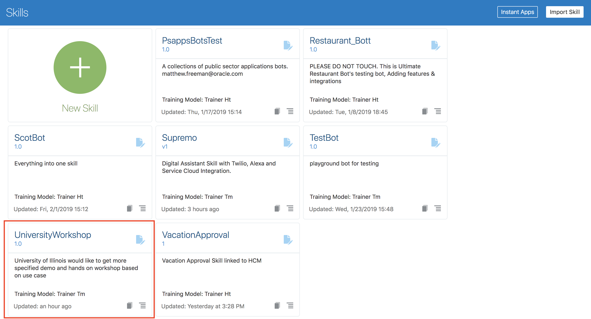
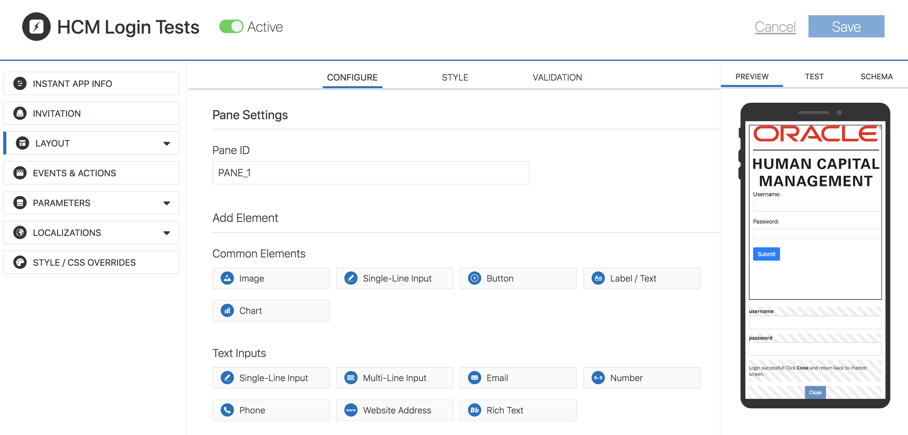
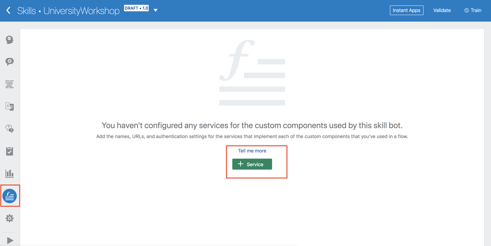
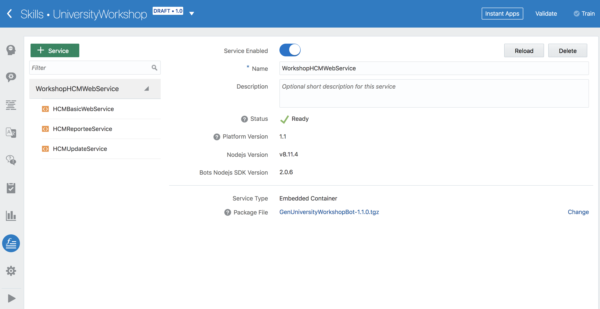
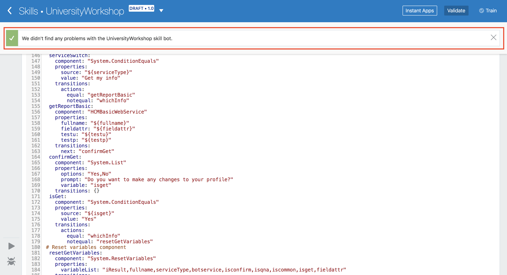

# Lab 200: Enhance Gen University Bot
## Introduction
This lab will dive into the details of development of the bot. We will be an importing entities' csv file for this bot, adding an instant app that serves as HCM service login, setting up Backends & API services for HCM backend service and lastly a custom component which integrates the get or update information with HCM backend service. This will make Gen University Bot more interactive.

## Objectives
- Learn about Intent feature of Bots
- Import an entity csv file to Gen University Bot
- Add an instant app of HCM login module to the bot interaction
- Set up Backend & API services for HCM web services
- Create service for the chatbot
- Add interactive dialog for the HCM service integrity of Bot workflow
## Required Artifacts
- The following lab requires an Oracle Public Cloud account. You may use your own cloud account, a cloud account that you obtained through a trial, or a training account whose details were given to you by an Oracle instructor.
- You should have completed Lab 100 of this workshop.

---
### Step 0: Learn about Intent feature of AMCes

- Navigate to University Workshop Bot that you have imported on lab 100. 



- On the first screen, you can define intents for your chatbot. Intents illustrate your use case by describing the various actions that your bot helps its users complete.
- There are 3 intents that came with the import file: Location, StartChat, and StopChat. Under each intent tab, there are utterances which are the sample phrases or sentences that you expect the user to say for that specific intent so that your bot will match those phrases to the intent. 


### Step 1: Import an entity csv file to Gen University Bot

- While intents map words and phrases to a specific action, entities add context to the intent itself. They help to describe the intent more fully and enable your bot to complete a user request. The Location intent, for example, describes a user request, but only in general terms. To fill in the specifics, this intent is augmented by the Facilities entity, which identifies values like 'morill Hall' from the user input. This step will guide you how to create entities for your chatbot:
  a. You can create your own entities, detailes see <a target="_blank" href="https://docs.oracle.com/en/cloud/paas/mobile-autonomous-cloud/use-chatbot/entities1.html#GUID-684BCEE1-F628-4172-88A7-6F693E1589DD">here</a>
  
  b. Import entites' file which is exported from university chatbot.
     - Click the icon under Intent icon
     - Click 'More' then choose 'Import Value list entities'
     - Upload 'UniversityWorkshop-Entities.csv' file which is cloned from 'Oracle-University-Workshop-Artifacts' gitbut repository.


### Step 2: Add an instant app of HCM login module to the bot interaction

- Note: With this Gen University chatbot, we are using Oracle HCM service, so if you want to test login module functionality, for HCM login username and password, you can send request from our end, then you may get a temporary account.

- Natural language conversations are, by their very nature, free-flowing. But they may not always be the best way for your bot to collect information from its users. For example, some situations, like sign in in some sites, require users to enter specific information (and enter it precisely). To help your bot’s users enter this type of information easily, your bot can call an instant app, which provides forms with labels, options, choices, check boxes, data fields, and other UI elements.

- Click on **Instance Apps** next to Validate button on top right of the screen. (This is a pop-up that might be blocked by your browser; unblock it to continue.)


- This will take you to a dashboard for Instance Apps. Here, we will click on **New Instance App**. 


- As you can see, there are many templates you can choose from to help you build an instant app. For today, we will import a pre-built one. Click on **Import an Instance App** on the top left of the screen and drag and drop **HCM-Login-Tests.json** from the folder you have cloned from github. 


- After you have done so, you should see a HCM Login in created. If it says inactive, go ahead and activate it. 


- Click on HCM Login app and click on **Layout** tab. You should be able to see a preview of the app on the right side. This is what the app will look like. Let's leave it as is and go back to the flow editor of Nom_Nom_Pizza_Bot.



- Click on **Save** on upper right of the screen to close


- To be able to use the instant app we just added, we need to add another state to our flow using `System.Interactive` component. This will be finished in Step 5.

### Step 3: Set up Backend & API services for HCM web services
- Now, Intents, Entities, and Intant app are ready, we need to create bot Backend & its API services which are supported in our AMCe. In order to get or update a student's basic information e.g. email, address, phone etc, we need to develop a backend service which can get or make the update real-time with Oracle HCM.

- Click on the hamburger menu button on the upper left of the screen, click 'Backends', then click '+ New Backend'.



- Once you click 'New Backend' button, fill the 'Name' (required) and 'Description' (optional), then click 'Create'.


- Click 'API' in the left panel, then click '+ New API'.


- Once you click 'New API', fill 'universityservice' as input words for 'API Display Name' and 'API Name', you can input anything you like to write down. Then, when you click 'Create' button, it will pop-up a tour, you can watch the video or click 'Got it'.  

  (Note: for this bot, we have developed our own custom component code which you can find from github cloned resources, so use the given API name.)

:: Before clicking 'Create' button


:: After clicking 'Create' button


- After you click 'Got it', it will forward to API portal and show the below webpage


- Holding on the API setting page, Click 'Implementation' in the left panel, then click 'Upload an implementation archive' and upload 'University_Workshop_components.zip' file.


- Once you upload that zip file successfully, then click 'Save' you will see the below screenshots:


- Select 'Endpoints' and click edit icon in the right corner, copy & paste all content from the file 'university.raml' which can be found in artifacts, then click edit icon again and save it, finally you will see two endponts has been configured.

  (Note: Once you paste the content, it takes a little bit time.)


- Select 'Security', disable 'Login Required', then click 'Save'


- Now, we can test your API and see its working or not.
  - Click 'Test' button on the right top corner
  

  - Choose below image options, then click 'Test Endpoint' and copy the url which can be used in the Backend configuration side.
  

  - If it is successful, you will get 'Test Response Status: 200' and its response body.
  
  

- Go back to 'Backends' via clicking hamburger menu button


- Double clicking 'UniversityWorkshop_Backend1.0', it will forward its setting page


- Click 'Settings' and Copy 'Backend ID' & 'Anonymous Key' which will be used to create service for the chatbot
  (Note: make sure you copy the entire value for the anonymous key.)


### Step 4: Create service for the chatbot
- Click on the hamburger menu button on the upper left of the screen, click 'Bots', Select 'UniversityWorkshop' bot, click the icon including 'f', then click 'Service' green button


- Fill all required information, paste backend ID, anonymous key and metadata url from above copied, then you will get successfuled message.


:: Successfuled messages




### Step 5: Add interactive dialog for the HCM service integrity of Bot workflow

- Now, let us integrate the workflow of Gen University Bot.

- Copy & Paste below block code under '#HERE - Copay & Paste HCM initial variables below'


**When copying, please also include the leading white spaces and/or indentation on the first line to avoid any errors.**
```
    fullname: "string"
    fieldattr: "string"
    login: "string"
    testu: "string"
    testp: "string"
    isconfirm: "string"
    isqna: "string"
    iscommon: "string"
    isget: "string"
    updateAttr: "UpdateFields"
    updatefield: "string"
    updateinfo: "string"
```
- Copy & Paste below block code under '# HERE - Copy HCM set variable YAML code below:'


**When copying, please also include the leading white spaces and/or indentation on the first line to avoid any errors.**
```
  setUsername:
    component: "System.SetVariable"
    properties:
      variable: "testu"
      value: "not set"
    transitions: {}
  setPassword:
    component: "System.SetVariable"
    properties:
      variable: "testp"
      value: "not set"
    transitions: {}
```

- Copy & Paste below block code under '# HERE - Replace new Main intent YMAL code below:'


**When copying, please also include the leading white spaces and/or indentation on the first line to avoid any errors.**
```
  Intent:
    component: "System.Intent"
    properties:
      variable: "iResult"
      confidenceThreshold: 0.4
      qnaEnable: true
    transitions:
      actions:
        StartChat: "HelloChat"
        StopChat: "ExitChat"
        Location: "locationIntro"
        qna: "qna"
        unresolvedIntent: "Unresolved"
```

- Copy & Paste below block code under '# HERE - Replace new pickOneService -> transitions YMAL code below'


**When copying, please also include the leading white spaces and/or indentation on the first line to avoid any errors.**
```
  transitions:
      actions:
        equal: "startQnAService"
        notequal: "startHCMService"
```

- Copy & Paste below block code under '# HERE - Copy & paste Q&A states' workflow below:'


**When copying, please also include the leading white spaces and/or indentation on the first line to avoid any errors.**
```
  startQnAService:
    component: "System.ResetVariables"
    properties:
      variableList: "iResult,isqna"
    transitions: {}
  askQnAService:
    component: "System.CommonResponse"
    properties:
      metadata:
        responseItems:
        - type: "text"
          text: "Welcome! Ask me a question. Example: What are the library hours?"
          name: "Sorry"
          separateBubbles: true
      processUserMessage: false
    transitions: {}
  qna:
    component: "System.QnA"
    properties:
      minimumMatch: "100%,100%"
      matchListLimit: 5
      enableCategoryDrilldown: false
      resultLayout: "vertical"
      exitLabel: "Exit Questions"
      keepTurn:
        next: true
        none: true
        exit: true
        textReceived: true 
    transitions:
      actions:
        none: "Unresolved"
      next: "confirmQnA"
  confirmQnA:
    component: "System.List"
    properties:
      options: "Yes,No"
      prompt: "Do you need more FAQ questions?"
      variable: "isqna"
    transitions: {}
  isQna:
    component: "System.ConditionEquals"
    properties:
      source: "${isqna}"
      value: "Yes"
    transitions:
      actions:
        equal: "startQnAService"
        notequal: "resetGetVariables"
```

- Copy & Paste below block code under '# HERE - Copy & Paste HCM Service states' workflow below:'

**When copying, please also include the leading white spaces and/or indentation on the first line to avoid any errors.**
```
  startHCMService:
    component: "System.ConditionEquals"
    properties:
      source: "${botservice}"
      value: "Student"
    transitions:
      actions:
        equal: "askHCMService"
        notequal: "ExitChat"
  askHCMService:
    component: "System.Text"
    properties:
      prompt: "Welcome!\nYou can view or update your profile. Please enter your name."
      variable: "fullname"
    transitions:
      actions:
        cancel: "Intent"
      next: "askServiceType"
  askServiceType:
    component: "System.List"
    properties:
      options: "${serviceType.type.enumValues}"
      prompt: "Would you like to check your current profile or update '${fullname}' profile?"
      variable: "serviceType"
    transitions: 
      actions: 
        cancel: "Intent"
      next: "signInOrnot"
  # HCM login workflow
  signInOrnot:
    component: "System.ConditionEquals"
    properties:
      source: "${testu}:${testp}"
      value: "not set:not set"
    transitions:
      actions:
        equal: "interactive"
        notequal: "serviceSwitch"
  interactive:
    component: "System.Interactive"
    properties:
      id: "HCM_Login_Tests"
      sourceVariableList: ""
      variable: "login"
      prompt: "Please click the link below to login" 
      linkLabel: "Login"
    transitions: {}
  resetUsername:
    component: "System.SetVariable"
    properties:
      variable: "testu"
      value: "${login.value.username}"
    transitions: {}
  resetPassword:
    component: "System.SetVariable"
    properties:
      variable: "testp"
      value: "${login.value.password}"
    transitions: {}
  serviceSwitch:
    component: "System.ConditionEquals"
    properties:
      source: "${serviceType}"
      value: "Get my info"
    transitions:
      actions: 
        equal: "getReportBasic"
        notequal: "whichInfo"
  getReportBasic:
    component: "HCMBasicWebService"
    properties:
      fullname: "${fullname}"
      fieldattr: "${fieldattr}"
      testu: "${testu}"
      testp: "${testp}"
    transitions:
      actions:
        cancel: "Intent"
      next: "confirmGet"
  confirmGet:
    component: "System.List"
    properties:
      options: "Yes,No"
      prompt: "Do you want to make any changes to your profile?"
      variable: "isget"
    transitions: {}
  isGet:
    component: "System.ConditionEquals"
    properties:
      source: "${isget}"
      value: "Yes"
    transitions:
      actions:
        equal: "whichInfo"
        notequal: "resetGetVariables"
 # Reset variables component
  resetGetVariables:
    component: "System.ResetVariables"
    properties:
      variableList: "iResult,fullname,serviceType,botservice,isconfirm,isqna,iscommon,isget,fieldattr"
    transitions:
      next: "HelloChat"
  
 # HCM Update Service Dialog Flow
  whichInfo:
    component: "System.List"
    properties:
      options: "${updateAttr.type.enumValues}"
      prompt: "What information would you like to update?"
      variable: "updateAttr"
    transitions: {}
  setUpdateField:
    component: "System.SetVariable"
    properties:
      variable: "updatefield"
      value: "${updateAttr}"
    transitions: {}
  resetUpdateVariables:
    component: "System.ResetVariables"
    properties:
      variableList: "iResult,updateinfo,isconfirm"
    transitions: {}
  setUpdateData: 
    component: "System.Text"
    properties: 
      prompt: "Okay! Please input your new ${updatefield}."
      variable: "updateinfo"
    transitions: {}
  confirmUpdate:
    component: "System.List"
    properties:
      options: "Yes,No"
      prompt: "Are you sure you want to update '${updateAttr}' to '${updateinfo}'"
      variable: "isconfirm"
    transitions: {}
  isUpdate:
    component: "System.ConditionEquals"
    properties:
      source: "${isconfirm}"
      value: "Yes"
    transitions:
      actions:
        equal: "updateService"
        notequal: "resetUpdateVariables"
  updateService:
    component: "HCMUpdateService"
    properties:
      fullname: "${fullname}"
      updatefield: "${updatefield}"
      updateinfo: "${updateinfo}"
      testu: "${testu}"
      testp: "${testp}"
    transitions: {}
  resetUpdateVariables1:
    component: "System.ResetVariables"
    properties:
      variableList: "iResult,updateinfo,isconfirm,updateAttr,isget"
    transitions:
      actions:
        cancel: "Intent"
      next : "getReportBasic"
```

- Click 'Validate' button, you will see below:


- Now, your test bot is ready, you can test the workflow right now by clicking 'play' button, and follow steps:


(If it is not working, you can copy & paste the entire content from the file - 'universityworkshopentire.ymal' which is cloned from github.)

- Then, next lab, it will introduce how to set up Q&A module service.

**[Navigate to Lab 300](Lab300.md)**