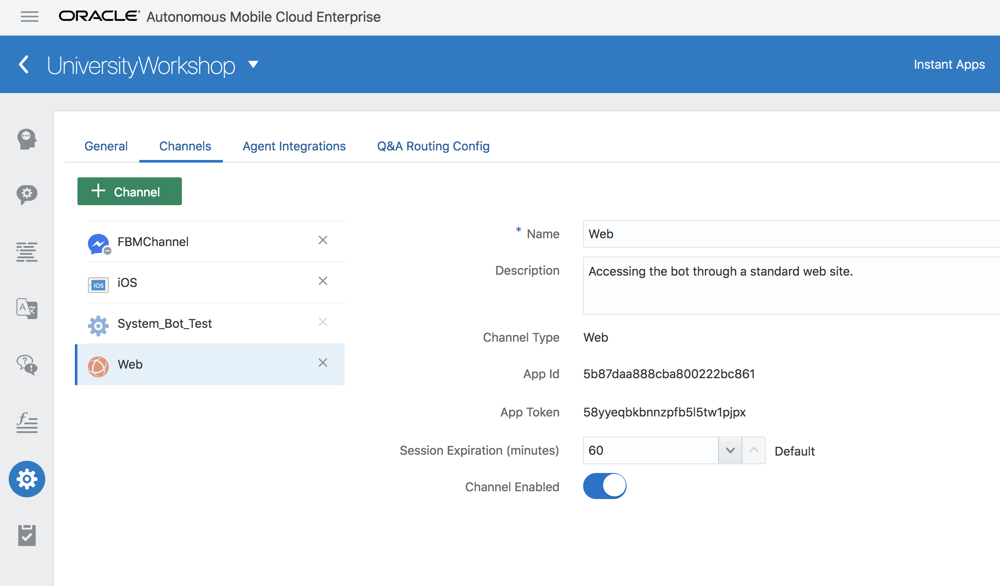
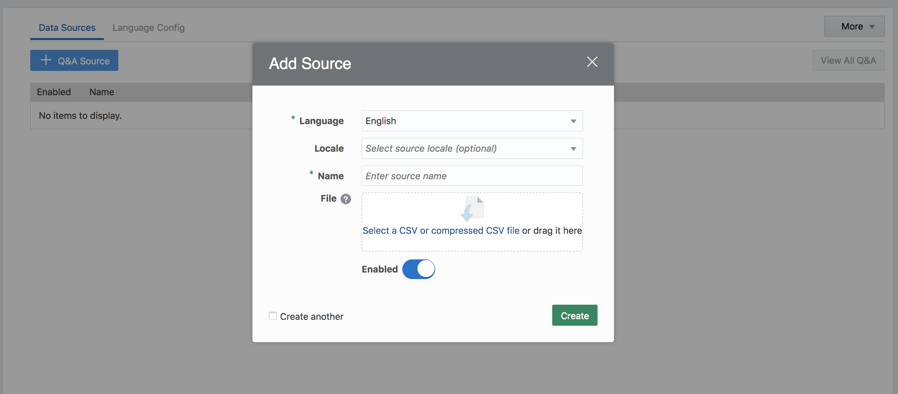
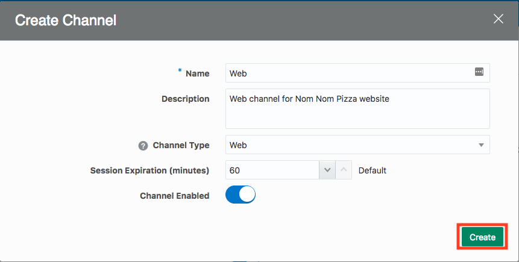
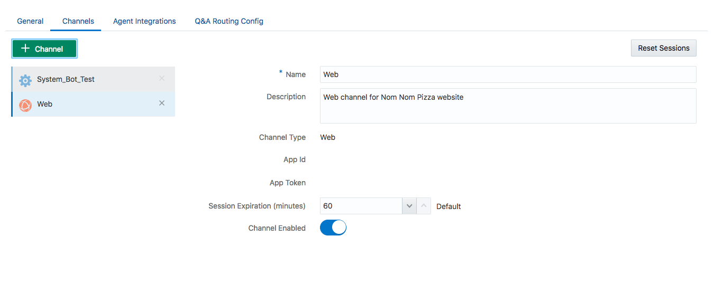
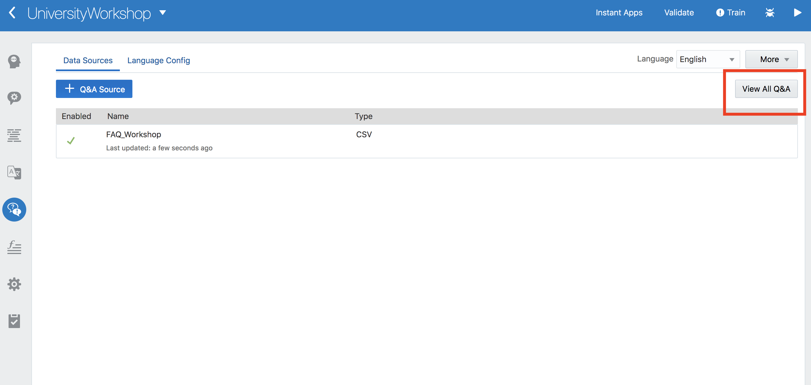
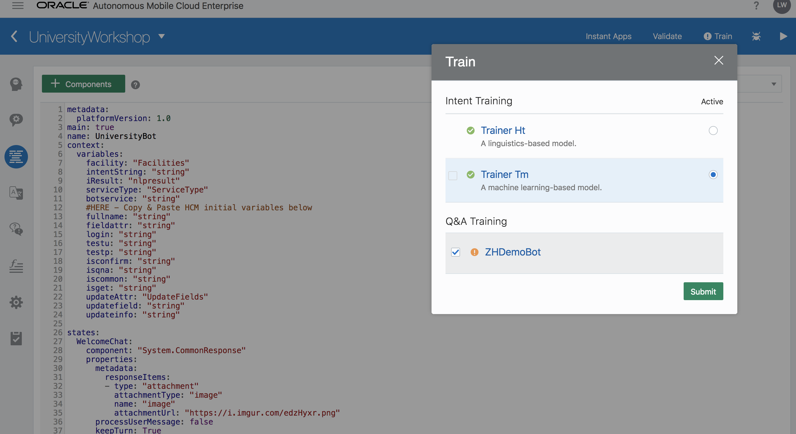

# Lab 300: Create Channel and Interact with Chatbot on Website
## Introduction
In this lab, we will learn about channels and make the chatbot available through the University site and Facebook messenger.

## Objectives
- Clear understanding of channels
- Integrating chatbot with website and facebook.

## Required Artifacts
- The following lab requires an Oracle Public Cloud account. You may use your own cloud account, a cloud account that you obtained through a trial, or a training account whose details were given to you by an Oracle instructor.
- You should have completed Lab 100 of this workshop.
- You should have completed Lab 200 of this workshop.

---
### Step 1: Add a Channel
Bots aren’t apps that you download from an app marketplace. Instead, users access them through messaging platforms or through client messaging apps, such as Facebook Messenger, a custom mobile app, or in our case, a website. Channels, which are platform-specific configurations, allow this access. A single bot can have several channels configured for it so that it can run on different services simultaneously.

- Navigate to UniversityWorkshop bot and click on Settings icon and **Channel**

- As you can see, by default, it has System_Bot_Test channel that is used on this dashboard where you did testing using the play button. 
- Click on **+ Channel** to add a new channel.

- Enter the following information in the prompt:
    - Name: `Web`
    - Description: `Web channel for Nom Nom Pizza website`
    - Channel Type: `Web`
    - Turn on **Channel Enabled**
- Click on **Create**

- Now you should see a web channel created. You should have your own App Id that we will use later.

### Step 2: Interact with Nom Nom Pizza Bot on Website
- Open up a browser and navigate to: <a href="https://nomnompizza-aserecruitfy19.uscom-central-1.oraclecloud.com/" target="_blank">Nom Nom Pizza Website</a>
- This is a website we have created for our fictional restaurant Nom Nom Pizza. Take a glance at the website. 

- Click on **Chat** button and enter in your App Id you received from creating a web channel.

- A chat window should automatically pop up on the side. Now, you can order pizza here! Go ahead and talk to it!

- In a real-world situation, instead of entering an App Id, you would have it somewhere in the web app and have the chat ready whenever a user gets into the website. 

- This concludes our chatbot workshop. The materials in this workshop is just the tip of the iceberg of Intelligent Bot and AMCe's capabilities. Here is the documentation for AMCe if you are interested in learning more: https://docs.oracle.com/en/cloud/paas/mobile-autonomous-cloud/index.html. We look forward to seeing what you can build with AMCe! 

- If you have any questions or would like more information, feel free to contact us at tom.huang@oracle.com and nardos.megersa@oracle.com . We are happy to set up demos, workshops, or prototypes for your use case! 