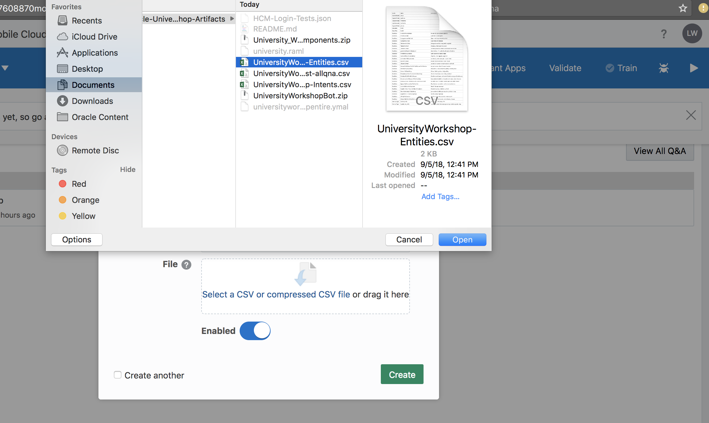
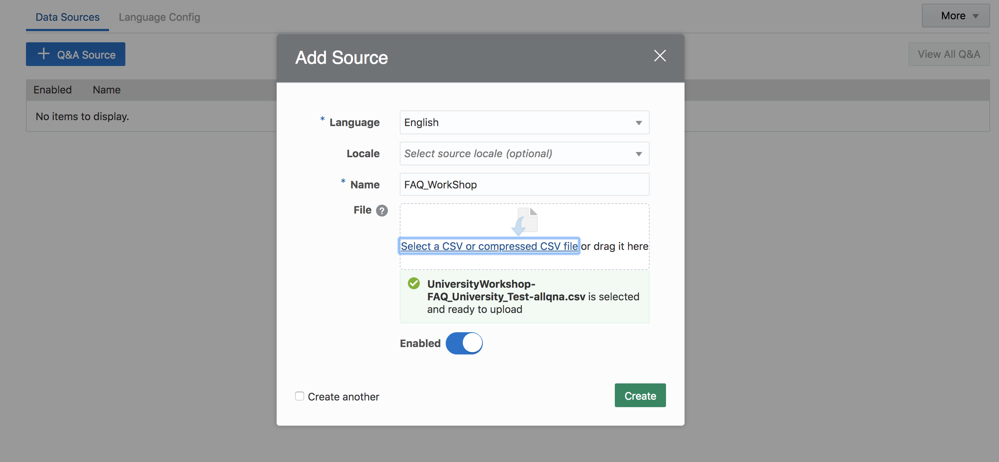
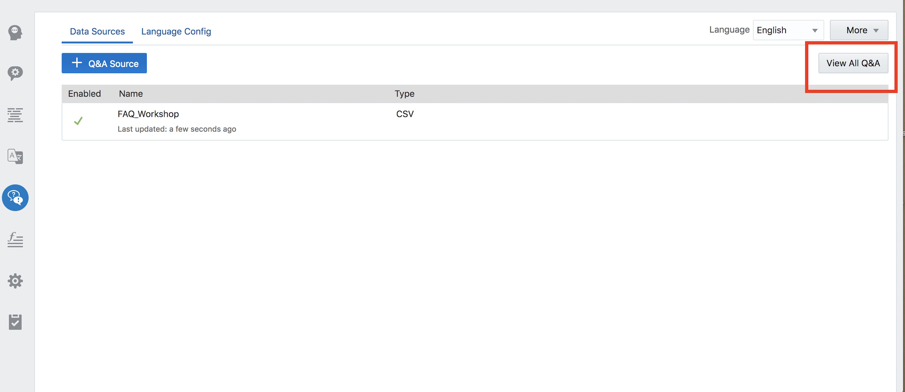
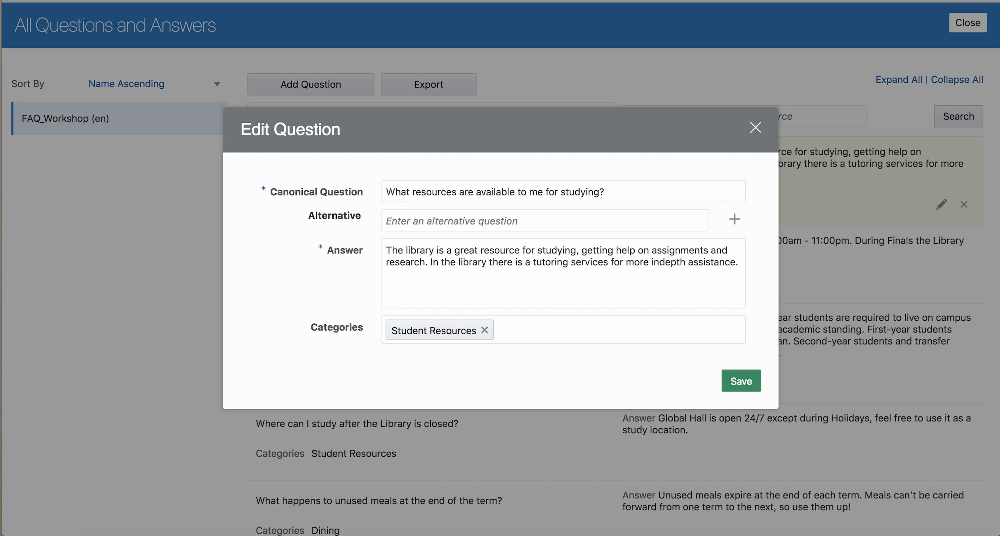
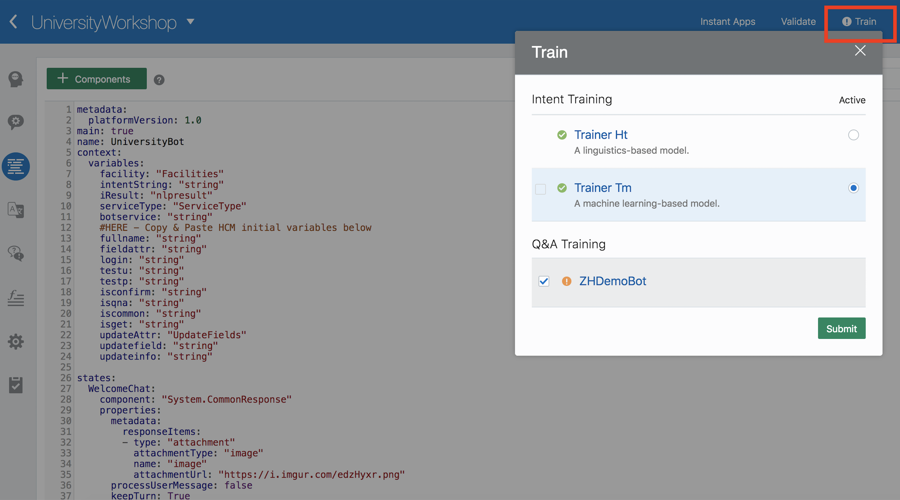
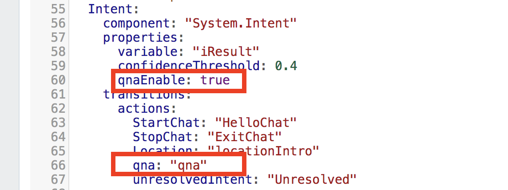
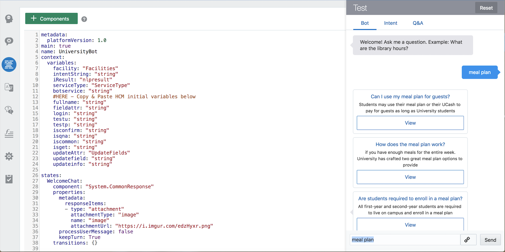

# Lab 300: Configuring Q&A Framework
## Introduction
In this lab, we will learn about how to add Q&A source to the skill.

## Objectives
- Upload FAQs as the Q&A Source
- Add component to the dialog flow
- Train and test the Q&A functionality

## Required Artifacts
- The following lab requires an Oracle Public Cloud account. You may use your own cloud account, a cloud account that you obtained through a trial, or a training account whose details were given to you by an Oracle instructor.
- You should have completed Lab 100 of this workshop.
- You should have completed Lab 200 of this workshop.

---
### Step 1: Upload FAQs as the Q&A Source
- Download the csv file **UniversityWorkshop-FAQ_University_Test-allqna** from the artifacts repository.
- Navigate to UniversityWorkshop bot and click on Q&A icon on the left side panel.


- You will see the Q&A page and now click on the **Q&A Source** to upload the csv file which you downloaded.


- Enter the following information in the prompt:
    - Language: `English`
    - Locale: Optional
    - Name: `FAQ_Workshp` for example
    - File: **UniversityWorkshop-FAQ_University_Test-allqna.csv**
    - Turn on **Channel Enabled**
- Click on **Create**





- Now you should see the FAQ source created.



- You can edit the questions to this source by clicking on **View All Q&A**. And then you also add or remove the questions by clicking on either **Add Question** option or remove option.




### Step 2: Adding component to the dialog flow and Training the skill.
- Once the Q&A source is added, you should train the skill. Go-to the YAML page and click on **Train** at the top right corner.



- If the training is successful, you will see training success message. 


- To use Q&A in a skill dialog flow, you need to configure the System.Qna component. You must also append a new transition to the System.Intent component that references this new component, so that Q&A questions are routed to the Q&A component.

- Goto the YAML page and modify the code to make the Q&A enabled in your skill.
- Enter **qna: "qna"** under the Intent section



- Replace the transitions code under pickOneService intent.

```
    transitions:
      actions:
        equal: "startQnAService"
        notequal: "startHCMService"

```


- Copy & Paste below block code under '# HERE - Copy & paste Q&A states' workflow below:'


```
  startQnAService:
    component: "System.ResetVariables"
    properties:
      variableList: "iResult,isqna"
    transitions: {}
  askQnAService:
    component: "System.CommonResponse"
    properties:
      metadata:
        responseItems:
        - type: "text"
          text: "Welcome! Ask me a question. Example: What are the library hours?"
          name: "Sorry"
          separateBubbles: true
      processUserMessage: false
    transitions: {}
  qna:
    component: "System.QnA"
    properties:
      minimumMatch: "100%,100%"
      matchListLimit: 5
      enableCategoryDrilldown: false
      resultLayout: "vertical"
      exitLabel: "Exit Questions"
      keepTurn:
        next: true
        none: true
        exit: true
        textReceived: true 
    transitions:
      actions:
        none: "Unresolved"
      next: "confirmQnA"
  confirmQnA:
    component: "System.List"
    properties:
      options: "Yes,No"
      prompt: "Do you need more FAQ questions?"
      variable: "isqna"
    transitions: {}
  isQna:
    component: "System.ConditionEquals"
    properties:
      source: "${isqna}"
      value: "Yes"
    transitions:
      actions:
        equal: "startQnAService"
        notequal: "resetGetVariables"

```

### Step 3: Testing the Skill for Q&A functionality
- Once the YAML code is ready, now click on the play button to test the skill
- Start the conversation by saying 'Hi'


- Select the visitor option and say 'Meal Plan' or any of the other questions from the FAQ csv.



**[Navigate to Lab 400](Lab400.md)**