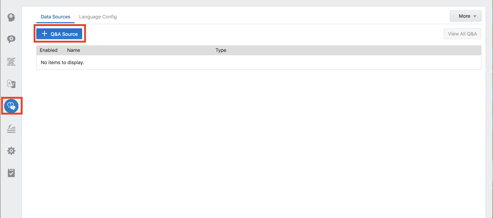
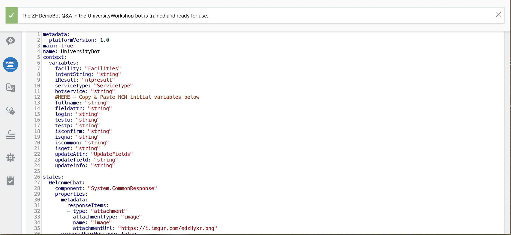

# Lab 300: Create Channel and Interact with Chatbot on Website
## Introduction
In this lab, we will learn about channels and make the chatbot available through the University site.

## Objectives
- Clear understanding of channels
- Integrating chatbot with website.

## Required Artifacts
- The following lab requires an Oracle Public Cloud account. You may use your own cloud account, a cloud account that you obtained through a trial, or a training account whose details were given to you by an Oracle instructor.
- You should have completed Lab 100 of this workshop.
- You should have completed Lab 200 of this workshop.

---
### Step 1: Add a Channel for website
Bots aren’t apps that you download from an app marketplace. Instead, users access them through messaging platforms or through client messaging apps, such as Facebook Messenger, a custom mobile app, or in our case, a website. Channels, which are platform-specific configurations, allow this access. A single bot can have several channels configured for it so that it can run on different services simultaneously.

- Navigate to UniversityWorkshop bot and click on Settings icon and **Channel**

- As you can see, by default, it has System_Bot_Test channel that is used on this dashboard where you did testing using the play button. 
- Click on **+ Channel** to add a new channel.

- Enter the following information in the prompt:
    - Name: `Web`
    - Description: `Web channel for University of Illinois`
    - Channel Type: `Web`
    - Turn on **Channel Enabled**
- Click on **Create**

- Now you should see a web channel created. You should have your own App Id (hidden in the picture for security purposes) that we will use later.

### Step 2: Interact with UniversityWorkshop Bot on Website
- Open up a browser and navigate to: https://objectstorage.us-ashburn-1.oraclecloud.com/n/gse00014632/b/GenUniversityBotSampleSite/o/index.html
- This is a website we have created for our generic university. Take a glance at the website. 

- Click on **Chat Head Icon** button and it will pop-up a chat window where you can get information about the university.

- You can test out the chat-bot by engaging with a simple conversation.

**[Navigate to Lab 400](Lab400.md)**