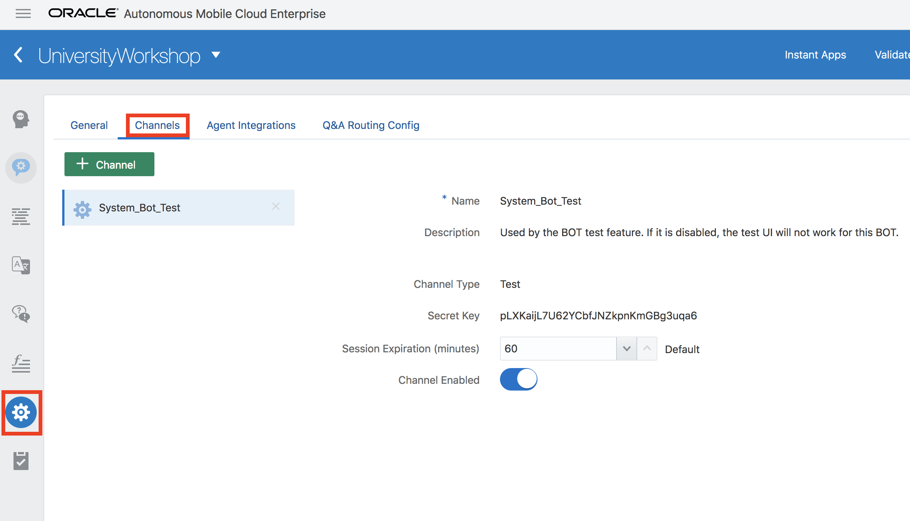
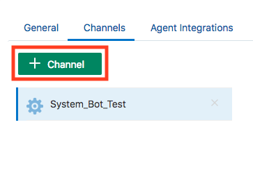
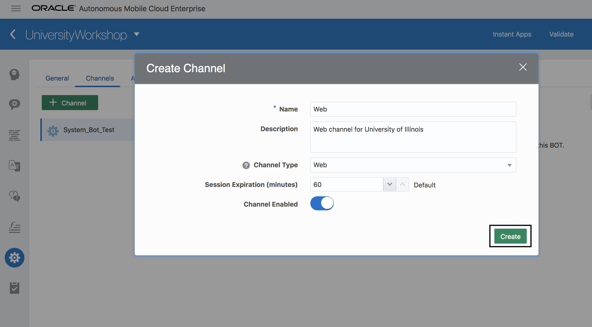
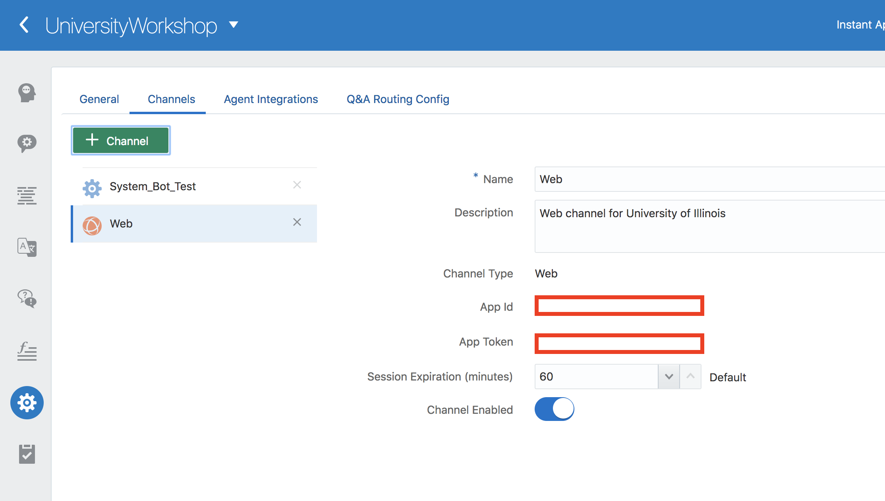
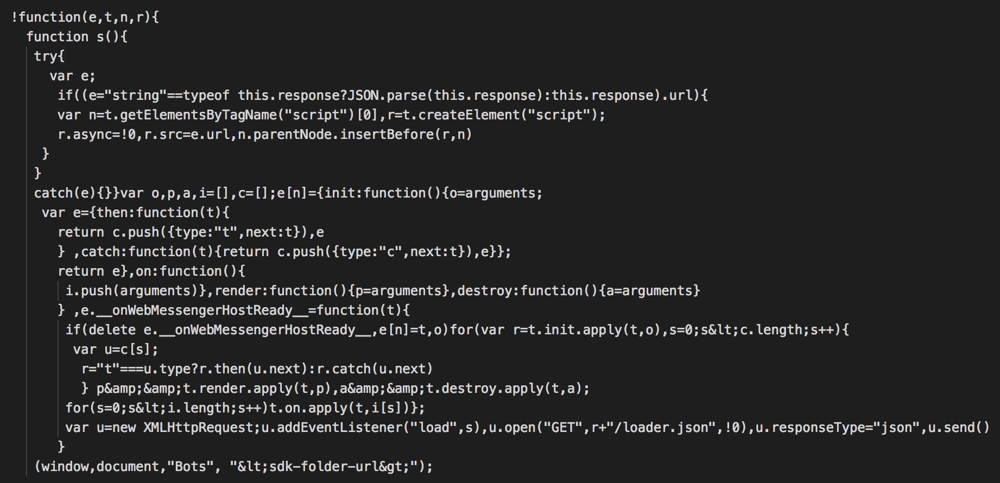
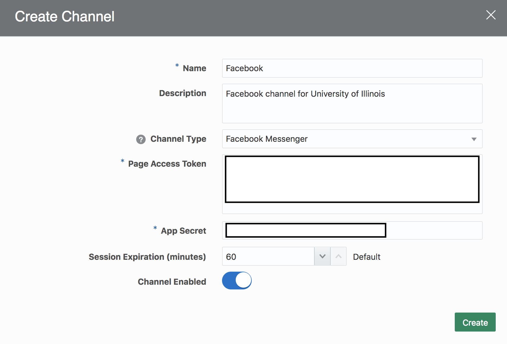
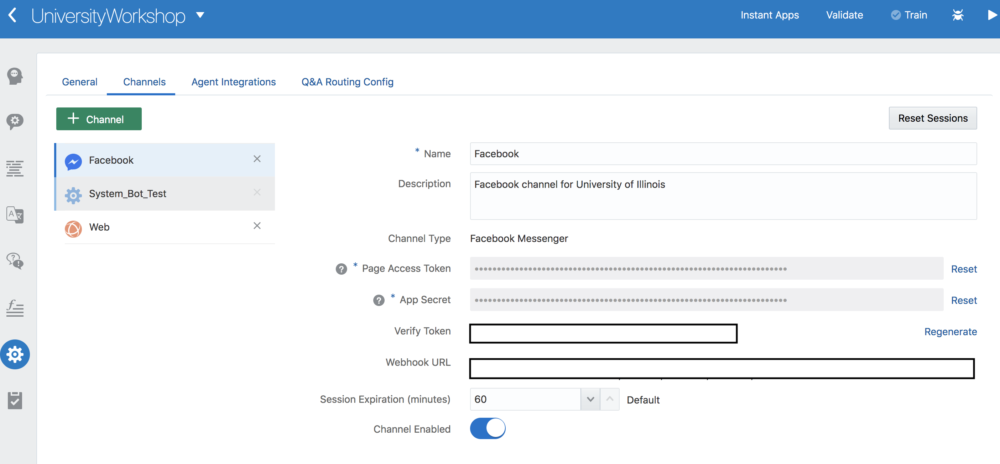
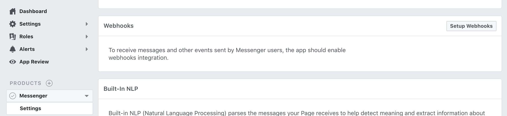
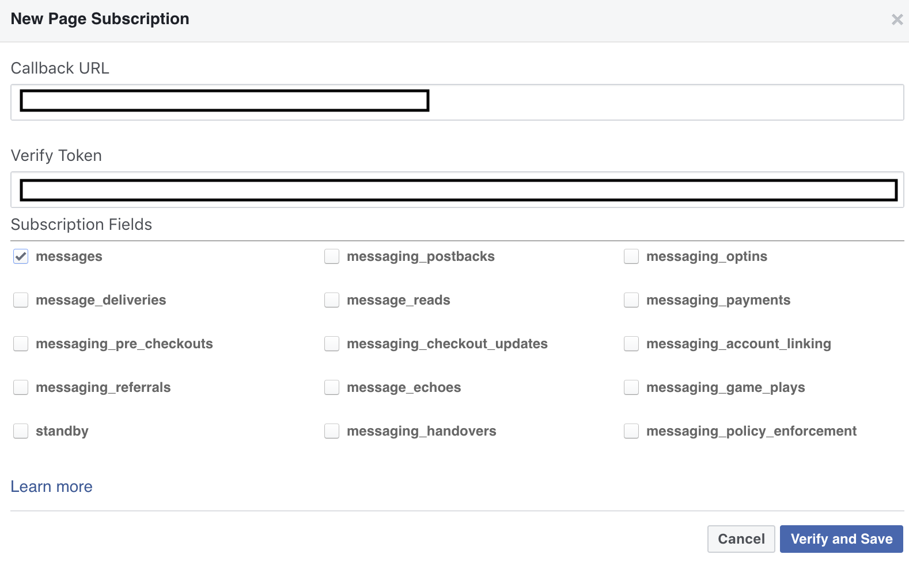
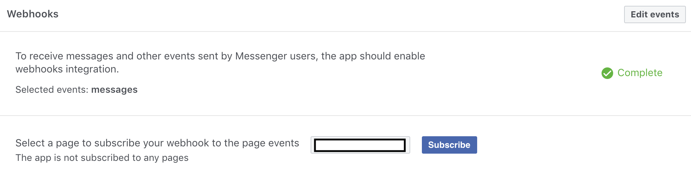

# Lab 400: Create Channel and Interact with Chatbot on Facebook Messenger
## Introduction
In this lab, we will learn about channels and make the chatbot available through the Facebook Messenger.

## Objectives
- Clear understanding of channels
- Integrating chatbot with facebook messenger.

## Required Artifacts
- The following lab requires an Oracle Public Cloud account. You may use your own cloud account, a cloud account that you obtained through a trial, or a training account whose details were given to you by an Oracle instructor.
- You should have completed Lab 100 of this workshop.
- You should have completed Lab 200 of this workshop.

---
### Step 1: Setting Up Facebook Messenger
Start off by generating the App Secret and the Page Access token in Facebook Messenger.
1. Log into your Facebook developer’s account.

2. Create a Facebook page that hosts your bot. The description, images, and cover page you add to the page will identify your bot to its users.

3. Next, create the Facebook app that you’ll link to this page. Because this is a Messenger app, choose Apps for Messenger and then click Create App ID.

Once you create the app, you will see the App ID on the top of your screen.

### Step 2: Set up messenger for your Facebook App.
Now click on the settings on the top left side pane and get the App Secret which is required to integrate with your UniversityWorkshop bot.

You should also add the messenger product to your app setup Messenger. Goto dashboard and click Setup under messenger product.

Once you added the messenger product, goto settings and scroll down until you find the Token Generation Card.
Select a facebook page which you have already created for the University of Illinois and copy the page access token which is generated dynamically.

### Step 3: Create facebook channel in the UniversityWorkshop bot.

- Navigate to UniversityWorkshop bot and click on Settings icon and **Channel**

- As you can see, by default, it has System_Bot_Test channel that is used on this dashboard where you did testing using the play button. 
- Click on **+ Channel** to add a new channel.

- Enter the following information in the prompt:
    - Name: `Facebook`
    - Description: `Facebook channel for University of Illinois`
    - Channel Type: `Facebook Messenger`
    - Page Access Token: Paste the page access token which you have copied.
    - App Secret: Paste the App Secret which you have copied.
    - Turn on **Channel Enabled**
- Click on **Create**

- Now you should see a facebook channel created. You should have your own Verify Token and Webhook URL (hidden in the picture for security purposes) that we will use later.

Copy the Webhook URL, Verify Token and navigate to the facebook developer page. Goto messenger settings and scroll down until you see Webhooks Card. Click on SetUp Webhook

Paste the Webhook URL and Verify Token which you copied from the UniversityWorkshop Bot, select the messages checkbox and click on Verify and Save button.

Once you are done, select the facebook page and click subscribe.

### Step 4: Interact with UniversityWorkshop Bot on Facebook.

Images of website with workshop bot