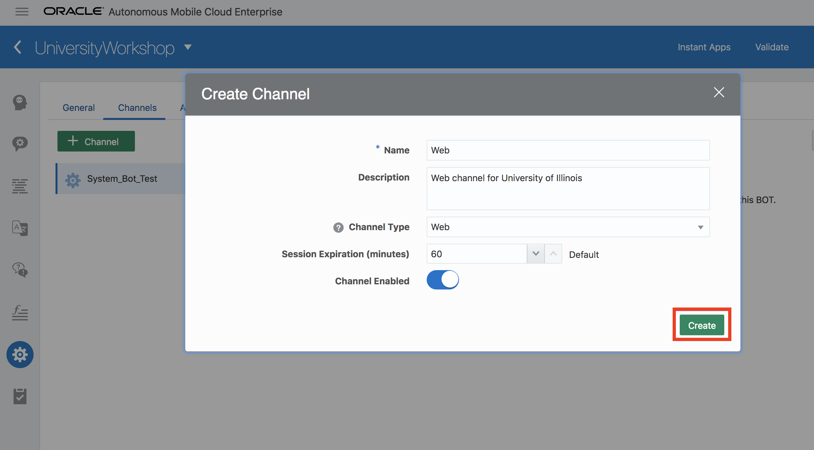
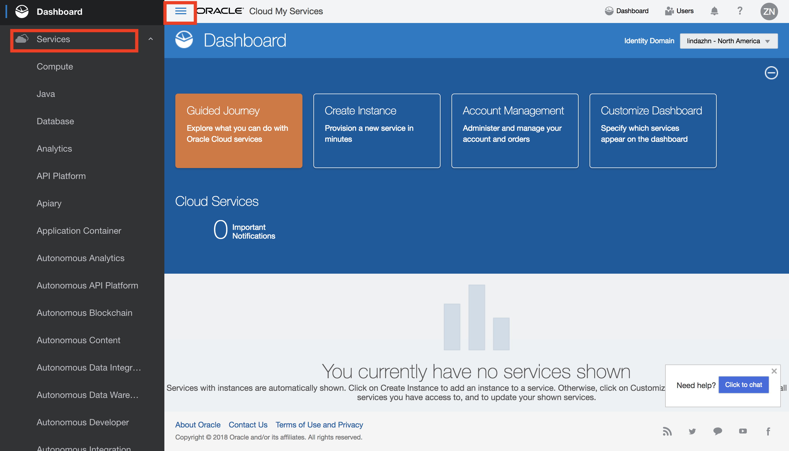

# Lab 400: Create Web Channel & Interact with Chatbot on Website
## Introduction
In this lab, we will learn about channels and make the chatbot available through the University site.

## Objectives
- Congfigure web channel for bot
- Configuring the Static Website with Chatbot SDK 
- Interact with UniversityWorkshop Bot on Website

## Required Artifacts
- The following lab requires an Oracle Public Cloud account. You may use your own cloud account, a cloud account that you obtained through a trial, or a training account whose details were given to you by an Oracle instructor.
- You should have completed Lab 100 of this workshop.
- You should have completed Lab 200 of this workshop.
- You may have completed Lab 300 of this workshop.

---
### Step 1: Add a Web Channel for website
Bots aren’t apps that you download from an app marketplace. Instead, users access them through messaging platforms or through client messaging apps, such as Facebook Messenger, a custom mobile app, or in our case, a website. Channels, which are platform-specific configurations, allow this access. A single bot can have several channels configured for it so that it can run on different services simultaneously.

- Navigate to UniversityWorkshop bot and click on Settings icon on the left side panel and **Channels** tab.

- As you can see, by default, it has System_Bot_Test channel that is used on this dashboard where you did testing using the play button. 
- Click on **+ Channel** to add a new channel.

- Enter the following information in the prompt:
    - Name: `Web` for example
    - Description: `Web channel for University of Illinois` for example
    - Channel Type: `Web`
    - Turn on **Channel Enabled**
- Click on **Create**

- Now you should see a web channel created. You should have your own App Id (hidden in the picture for security purposes) that we will use later.

### Step 2: Configuring the Static Website with Chatbot SDK

- Once the channel is configured in the chatbot, select the **UniversityWebsite.zip** from the files you cloned from git.
- In order to configure the chatbot on a webpage, you must use the Client SDK **http://www.oracle.com/technetwork/topics/cloud/downloads/amce-downloads-4478270.html** for Javascript in your static html file.
- To make this workshop easier, the Client SDK is deployed in Oracle Cloud Storage **https://objectstorage.us-ashburn-1.oraclecloud.com/n/gse00014632/b/AMCEbotSDK/o**

- Open up the **index.html** file from **UniversityWebsite** folder, copy and paste the code below under **Beginning of University Bot init script.**

**When copying, please also include the leading white spaces and/or indentation on the first line to avoid any errors.**

'''
    
'''

- Copy and paste the below code under **Beginning of bots Init Script**

**When copying, please also include the leading white spaces and/or indentation on the first line to avoid any errors.**

'''

    

'''

- In the above script, make sure to replace the **App-ID** with your app-id copied from creating the channel.
- Zip up the contents in the folder and rename it as **genUniversityWebsite.zip**

### Step 3: Deploying the static website in Oracle Application Container Cloud
- Open up a browser and navigate to: https://cloud.oracle.com/en_US/sign-in 
- Sign in using the credentials you used to create the free trail account.
- Now, you are in the Oracle Cloud dashboard. Click on the hamburger menu button on the upper left of the screen and expand **Services.**

- Scroll down and find **Application Container** and click on it.

- It will take you to the welcome screen of Application Container and now click on **Go to Console** button

- Now to deploy the static website, click on the **Create Application**

- You will be provided with a bunch of different application types. Select **Node**

- Provide an appropriate Name for your service and upload the zip file for application.

- Once the zip file is uploaded, change the instances to **1** and then click **Create**

- Once application is created (may take upto **20 minutes**), you will be able to find a link using which you can interact with your bot.

### Step 4: Interact with UniversityWorkshop Bot on Website
- Open up a browser and navigate to the link which your service provided in the last step.
- This is a website we have created for our generic university. Take a glance at the website. 

- Click on **Chat Head Icon** button and it will pop-up a chat window where you can get information about the university.

- You can test out the chatbot by engaging with a simple conversation.

**[Navigate to Lab 500](Lab500.md)**