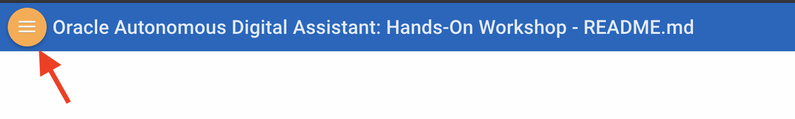

  
# Autonomous Mobile Cloud Enterprise - Intelligent Bot: Hands-On Workshop

This workshop walks you through all the steps to get started with using **Autonomous Mobile Cloud Enterprise (AMCe)** and guide you to create your first chatbot using the **Intelligent Bot** feature of AMCe. You will learn to create an university chatbot, utilize its extensive functionalities to build workflow, configure backend & api, train FAQ/Q&A module, finally interact with different channels, such as website, facebook etc, Gen University Bot. 

## Gen University Bot features:

## Goals
- Understand AMCe features
- Create a new chatbot
- Learn how to add intent & entities to chatbot
- Learn how to add services & components to enhance chatbot
- Learn how to add Q&A functionality
- Learn how to add a new channel
- Interact with the bot on a website/facebook

## Prerequisites
- Install git

## How to View the Lab Guides

- The Lab Guides are best viewed using the Workshop's [GitHub Pages Website URL](https://github.com/restonappdev/Oracle-University-Workshop/blob/master/README.md) 

- Once you are viewing the Workshop's GitHub Pages website, you can see a list of Lab Guides at any time by clicking on the **Menu Icon**

      

**[Navigate to Lab 100](Lab100.md)**